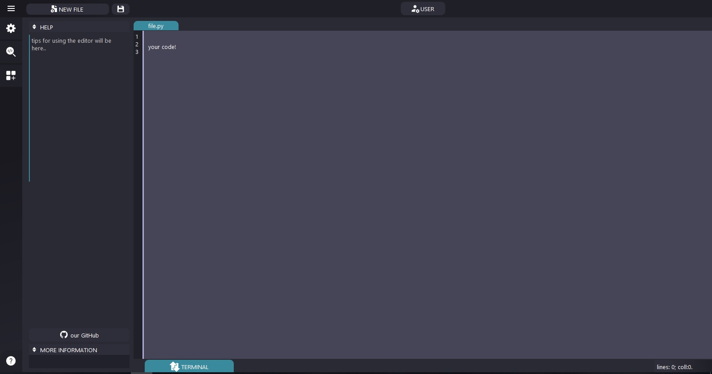

# HEAVENcode
HEAVEN code will allow you to create your own python programs in a convenient and beautiful editor.
## Features
- code highlighting;
- tracking variables;
- code highlight customization.
## Dependencies
- pyQt5;
- os.

## Interface
DEMO code editor interface:

